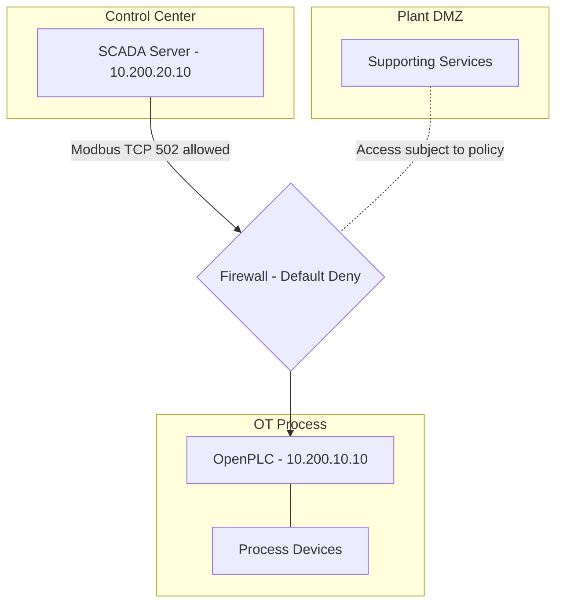

# OT Water Treatment — Logical Security Architecture

**Scope:** Conceptual security-zone diagram, not a complete representation of all 22 devices.

**Validation status:** Firewall rule configured; end-to-end communications and IDS behavior have not yet been verified.
